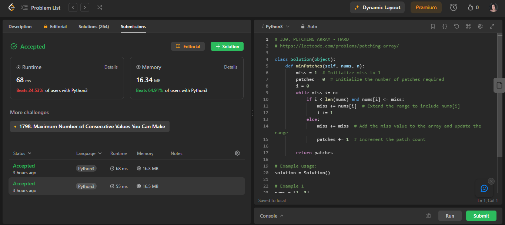
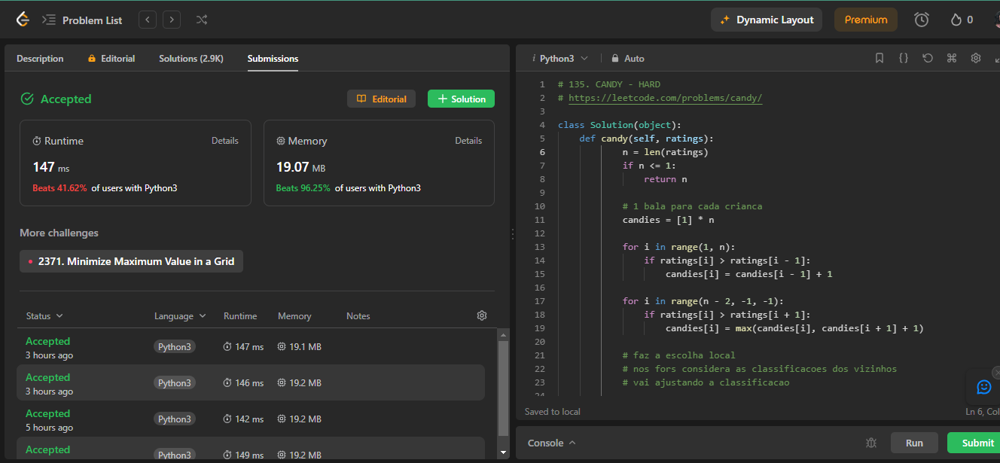
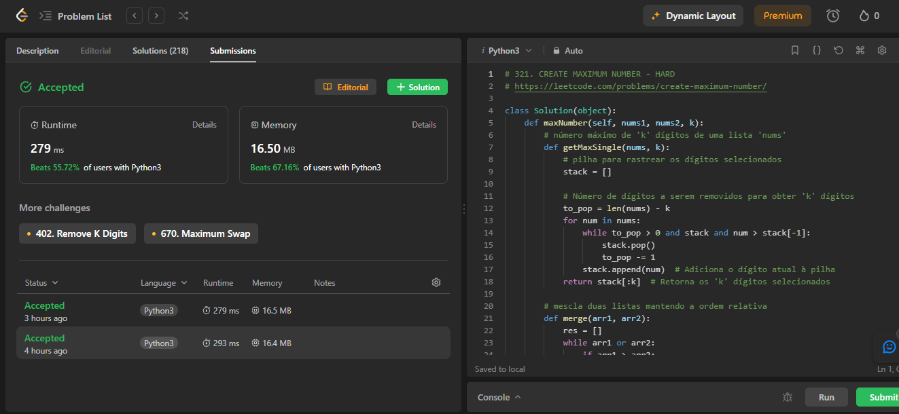
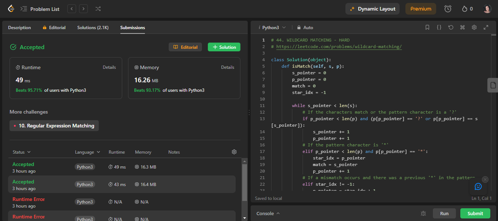

# Greed_ExerciciosJuizOn

**Número da Lista**: 3 
**Conteúdo da Disciplina**: Algoritmos Ambiciosos  

## Alunos
|Matrícula | Aluno |
| -- | -- |
| 20/0026046  |  Pedro de Oliveira Campos Barbosa |
| 20/2045268  | Raquel Temóteo Eucaria Pereira da Costa|

## Exercícios Leet Code
|ID|Título               |Resposável|Nível  |Link                                                          |
|--|---------------------|----------|-------|--------------------------------------------------------------|
|1 |Patching Array       | Pedro    |Difícil|[Link 1](https://leetcode.com/problems/patching-array/)       |
|2 |Candy                | Raquel   |Difícil|[Link 2](https://leetcode.com/problems/candy/)                |
|3 |Create Maximum Number| Raquel   |Difícil|[Link 3](https://leetcode.com/problems/create-maximum-number/)|
|4 |Wildcard Matching    | Pedro    |Difícil|[Link 4](https://leetcode.com/problems/wildcard-matching/)    |

## Aprovação

✅ **1. Patching Array** 

✅ **2. Candy**

✅ **3. Create Maximum Number**

✅ **4. Wildcard Matching** 

## Apresentação
[Link do vídeo](./video/greed.mp4) de apresentação.